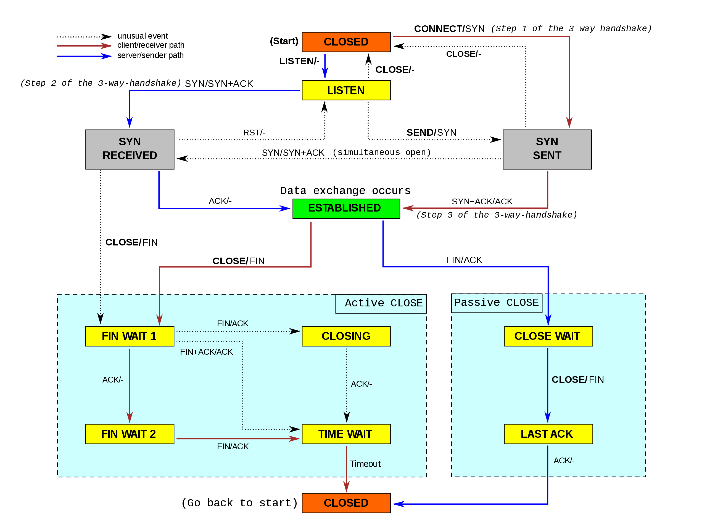

# akka-fsm-intro

The ./docs directory contains some "slides". These introduce the basic Akka FSM concepts.

## tcp-fsm

An example project which demonstrates Akka FSM. The code models a simplified TCP state machine. Two Akka actors do a 2- or 3-way-handshake to establish a "connection". Once established, the actors can send "data" via their connection. When data transfer is done, the TCP connection teardown can be initiated.

## State Machine

### TCP/IP Guide

### Wikipedia

## Resources

- Akka FSM: https://doc.akka.io/docs/akka/current/fsm.html
- TCP State Machine Wikipedia: https://en.wikipedia.org/wiki/Transmission_Control_Protocol#/media/File:Tcp_state_diagram_fixed_new.svg
- TCP State Machine: http://www.tcpipguide.com/free/t_TCPOperationalOverviewandtheTCPFiniteStateMachineF-2.htm
